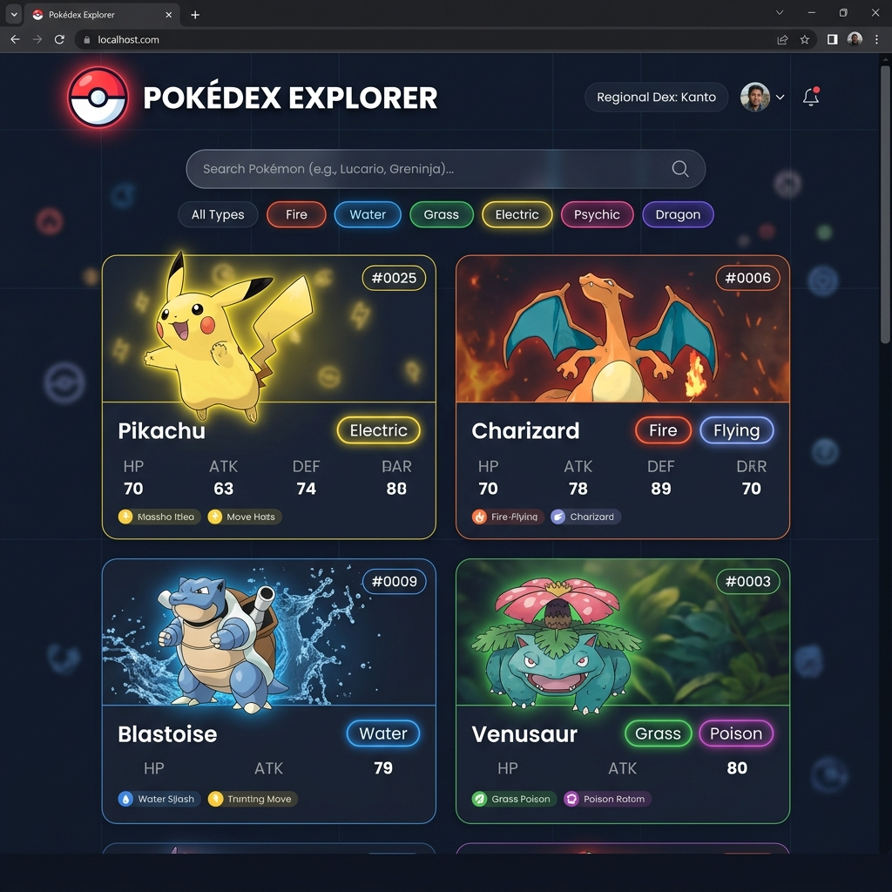
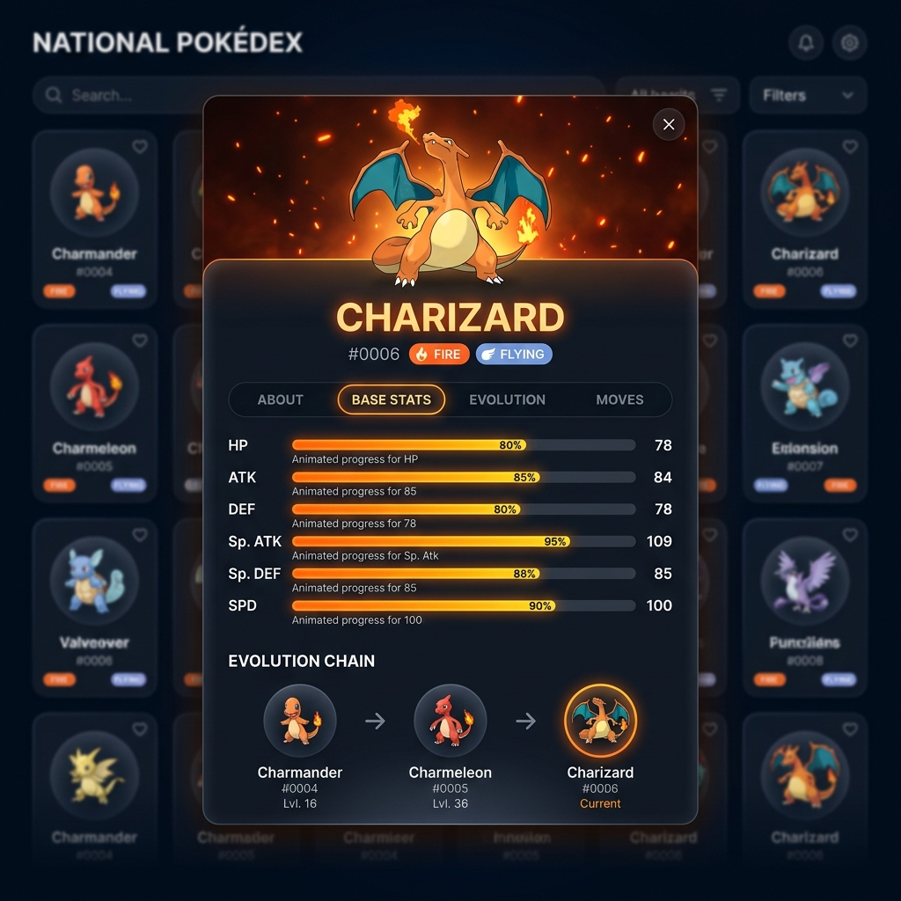

<h1 align="center">
  <br>
  
  <br>
  Pokédex Explorer
  <br>
</h1>

<h4 align="center">A high-performance, interactive Pokédex built with React, Vite, Tailwind CSS, and PokeAPI.</h4>

<p align="center">
  <a href="#key-features">Key Features</a> •
  <a href="#tech-stack">Tech Stack</a> •
  <a href="#project-structure">Project Structure</a> •
  <a href="#getting-started">Getting Started</a> •
  <a href="#screenshots">Screenshots</a>
</p>

---

## ⚡ Overview

**Pokédex Explorer** is a modern, high-performance web application for browsing Pokémon stats, element types, abilities, movesets, and interactive evolution paths in real time.

Originally built to practice React hooks and Axios, this application has been optimized to handle data gracefully with **on-demand fetching**, **glassmorphism styling**, **dynamic type gradients**, and **shimmer loading skeletons**.

---

## ✨ Key Features

- 🔍 **Real-Time Search & Direct Lookup:** Search Pokémon by name or ID (e.g., `#0025` or `Pikachu`) with instant response.
- ⚡ **Elemental Type Filtering:** Filter Pokémon by element type (Fire, Water, Grass, Electric, Psychic, Dragon, etc.).
- 📊 **Visual Base Stat Progress Meters:** Color-coded stat bars showing HP, Attack, Defense, Special Attack, Special Defense, and Speed (out of 255 max base stat).
- 🧬 **Interactive Evolution Tree:** Recursively renders evolution stages with high-res artwork thumbnails and evolution requirement badges.
- 🚀 **Optimized API Performance:** Solved the N+1 fetching problem by loading full species and evolution details on-demand when inspecting a Pokémon.
- 🎨 **Dynamic Type Aesthetic:** Custom glassmorphic cards and modal overlays with gradients dynamically tailored to primary Pokémon types.
- 📱 **Fully Responsive Layout:** Optimized for mobile, tablet, and desktop screens with seamless pagination controls.

---

## 🛠️ Tech Stack

- **Framework:** [React 18](https://react.dev/)
- **Build Tool:** [Vite](https://vitejs.dev/)
- **Styling:** [Tailwind CSS](https://tailwindcss.com/) + Custom Glassmorphism & Animations
- **HTTP Client:** [Axios](https://axios-http.com/)
- **API Source:** [PokeAPI v2](https://pokeapi.co/)
- **Typography:** Google Fonts (*Outfit* & *Plus Jakarta Sans*)

---

## 📁 Project Structure

```
pokedex/
├── public/
├── src/
│   ├── components/
│   │   ├── EvolutionChain.jsx     # Interactive evolution tree component
│   │   ├── FilterBar.jsx          # Search bar, type filter pills, and sorting dropdown
│   │   ├── LoadingSkeleton.jsx    # Shimmer placeholder skeleton card loader
│   │   ├── Pagination.jsx         # Page navigation controls & indicators
│   │   ├── PokemonCard.jsx        # Grid card with type gradient & hover effects
│   │   ├── PokemonDetailModal.jsx # Detailed modal with About, Stats, Evolution & Moves
│   │   └── StatBar.jsx            # Animated base stat progress bar
│   ├── utils/
│   │   ├── api.jsx                # Axios API instance configuration
│   │   └── pokemonHelpers.js      # Type colors, image fallbacks, and text formatting helpers
│   ├── App.jsx                    # Main application orchestration & state
│   ├── App.css                    # Tailwind directives & glassmorphism styling
│   └── main.jsx                   # React root mount point
├── index.html                     # HTML head with Google Fonts & SEO meta tags
├── package.json                   # Project dependencies & scripts
└── tailwind.config.js             # Tailwind configuration
```

---

## 🚀 Getting Started

### Prerequisites

Ensure you have [Node.js](https://nodejs.org/) (version 16 or higher) installed on your machine.

### Installation

1. **Clone the repository:**
   ```bash
   git clone https://github.com/mossstak/pokedex.git
   cd pokedex
   ```

2. **Install dependencies:**
   ```bash
   npm install
   ```

3. **Start the development server:**
   ```bash
   npm run dev
   ```

4. **Build for production:**
   ```bash
   npm run build
   ```

---

## 📸 Screenshots

### Grid Dashboard & Element Filters


### Detailed View, Base Stats & Evolution Chain


